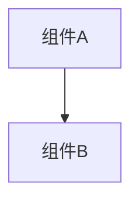

# Design Document

## Overview

[设计概述]

## Architecture

[架构设计，可包含 Mermaid 图]



## Components and Interfaces

### Component 1

[组件描述]

```typescript
interface IComponent1 {
  method(): void;
}
```

## Data Models

[数据模型定义]

## Error Handling

[错误处理策略]

## Testing Strategy

[测试策略]
